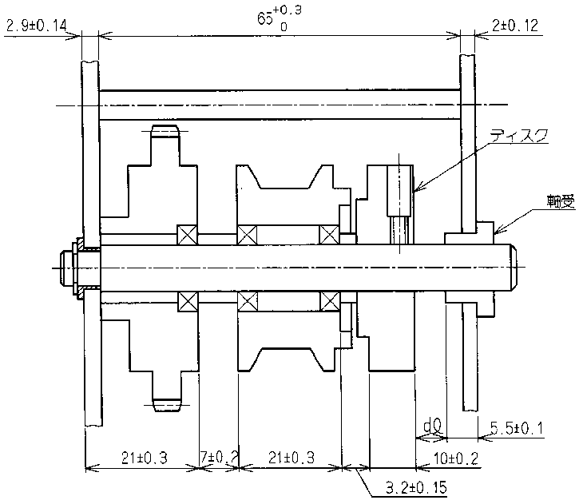

# Tolerance-caculator

## **이론 정리**
### **1. 누적 공차**
- 가공 부품들을 조립했을 때 누적되어 발생하는 공차를 누적 공차 또는 조립 공차라고 함.   
 

### **2. 공차 분석의 종류**
- Worst Case: 각 공차의 단순 합
- Root Sum Square: 정규분포에 따른 통계적 합산
- 회사 자체 기준: Wors Case와 RSS의 조합   
 

### **3. 누적 공차 수식** ###
- Worst Case:
  - $n$은 부품 수, $T_{i}$은 각각의 공차일 때 모두 더함.

$$ T_{sum} = \displaystyle \sum_{i = 1}^{n} T_i$$

- RSS:
  - 각각의 공차의 제곱의 합의 제곱근을 구하여 누적 공차를 구함.

$$ T_{sum} = \sqrt{ \displaystyle \sum_{i = 1}^{n} T_i^2 }$$

- 혼합 방법:
  - 근무했던 직장의 자체 규격으로, 부품 수가 2개인 경우 Worst Case와 동일하고 부품 수가 많을 수록 RSS에 가까워짐

$$ T_{sum} = \frac{(n-2) \sqrt{ \displaystyle \sum_{i=1}^{n} T_i^2 } + 2\displaystyle \sum_{i=1}^{n} T_i}{n}$$

 

### **4. 예시 적용** ###
- 다음과 같이 공차를 가진 9개 치수가 있는 조립품이 있을 때 $d0$의 누적 공차 구하기

</img>

 

- 편측 공차 치수는 양측 공차로 환산하여 계산

$$ 65_{0}^{+0.3} \to 65.15\pm0.15 $$

- 치수 계산은 치수 누적 방향에 유의하여 계산

$$ m = -10-3.2-21-7-21+2.9+65.15+2-5.5 = 2.35$$

- 각 방식별로 공차 계산

$$ T_{Worst Case} = 0.2 + 0.15 + 0.3 + 0.2 + 0.3 + 0.14 + 0.15 + 0.12 + 0.1 = 1.66$$
$$ \therefore 2.35 \pm 1.66$$

 

$$ T_{RSS} = \sqrt{0.2^2 + 0.15^2 + 0.3^2 + 0.2^2 + 0.3^2 + 0.14^2 + 0.15^2 + 0.12^2 + 0.1^2} = 0.59$$
$$ \therefore 2.35 \pm 0.59$$

 

$$ T_{Combination} = \frac{(9-2)\sqrt{0.2^2 +... + 0.1^2}+2(0.2+ ... + 0.1)}{9} = 0.83$$
$$ \therefore 2.35 \pm 0.83$$